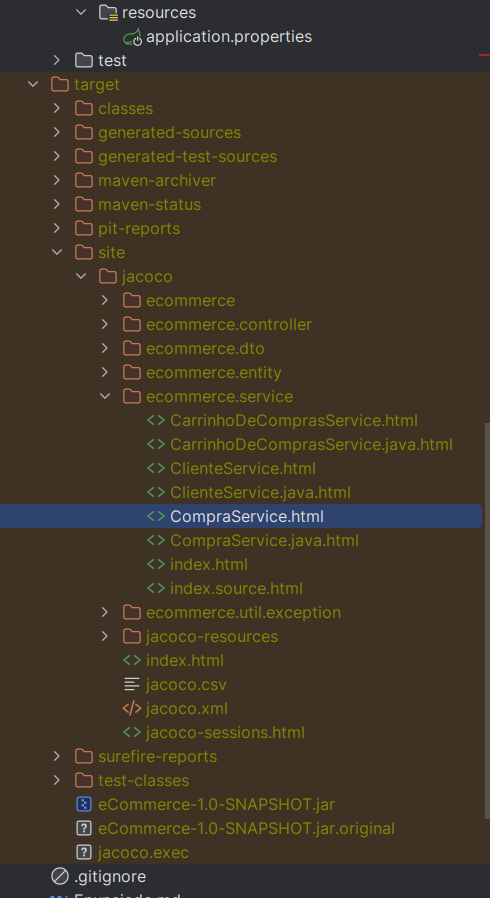
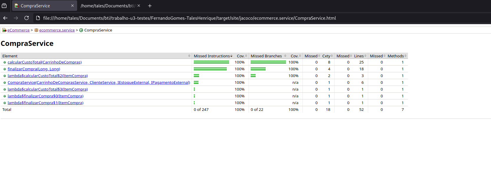
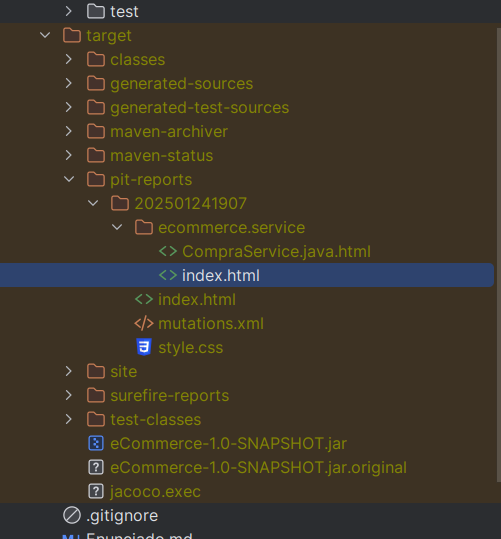
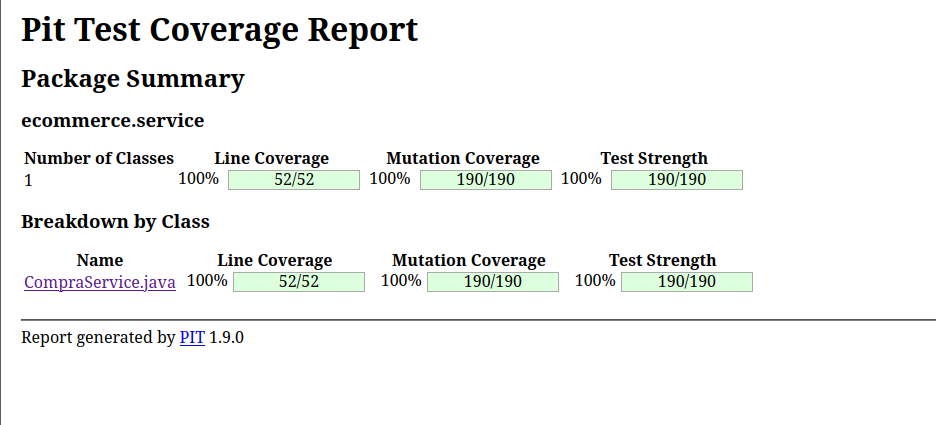

# FernandoGomes-TalesHenrique (eCommerce)


<details>
<summary>

## 🧪 Como executar os testes

</summary>

Execute o comando `mvn clean install org.pitest:pitest-maven:mutationCoverage`.
O output deve ser semelhante ao log abaixo


```bash
[INFO] Scanning for projects...
[INFO] 
[INFO] -----------------------< br.ufrn.imd:eCommerce >------------------------
[INFO] Building eCommerce 1.0-SNAPSHOT
[INFO]   from pom.xml
[INFO] --------------------------------[ jar ]---------------------------------
[INFO] 
[INFO] --- clean:3.2.0:clean (default-clean) @ eCommerce ---
[INFO] Deleting /home/tales/Documents/bti/trabalho-u3-testes/eCommerce-v20242/target
[INFO] 
[INFO] --- jacoco:0.8.10:prepare-agent (default) @ eCommerce ---
[INFO] argLine set to -javaagent:/home/tales/.m2/repository/org/jacoco/org.jacoco.agent/0.8.10/org.jacoco.agent-0.8.10-runtime.jar=destfile=/home/tales/Documents/bti/trabalho-u3-testes/eCommerce-v20242/target/jacoco.exec
[INFO] 
[INFO] --- resources:3.3.1:resources (default-resources) @ eCommerce ---
[INFO] Copying 1 resource from src/main/resources to target/classes
[INFO] Copying 0 resource from src/main/resources to target/classes
[INFO] 
[INFO] --- compiler:3.11.0:compile (default-compile) @ eCommerce ---
[INFO] Changes detected - recompiling the module! :source
[INFO] Compiling 21 source files with javac [debug release 17] to target/classes
[INFO] 
[INFO] --- resources:3.3.1:testResources (default-testResources) @ eCommerce ---
[INFO] skip non existing resourceDirectory /home/tales/Documents/bti/trabalho-u3-testes/eCommerce-v20242/src/test/resources
[INFO] 
[INFO] --- compiler:3.11.0:testCompile (default-testCompile) @ eCommerce ---
[INFO] Changes detected - recompiling the module! :dependency
[INFO] Compiling 2 source files with javac [debug release 17] to target/test-classes
[INFO] 
[INFO] --- surefire:3.0.0:test (default-test) @ eCommerce ---
[INFO] Using auto detected provider org.apache.maven.surefire.junitplatform.JUnitPlatformProvider
[INFO] 
[INFO] -------------------------------------------------------
[INFO]  T E S T S
[INFO] -------------------------------------------------------
[INFO] Running ecommerce.CarrinhoServiceTest
19:06:54.794 [main] INFO org.springframework.test.context.support.AnnotationConfigContextLoaderUtils -- Could not detect default configuration classes for test class [ecommerce.CarrinhoServiceTest]: CarrinhoServiceTest does not declare any static, non-private, non-final, nested classes annotated with @Configuration.
[INFO] Tests run: 53, Failures: 0, Errors: 0, Skipped: 0, Time elapsed: 4.842 s - in ecommerce.CarrinhoServiceTest
[INFO] 
[INFO] Results:
[INFO] 
[INFO] Tests run: 53, Failures: 0, Errors: 0, Skipped: 0
[INFO] 
[INFO] 
[INFO] --- jacoco:0.8.10:report (report) @ eCommerce ---
[INFO] Loading execution data file /home/tales/Documents/bti/trabalho-u3-testes/eCommerce-v20242/target/jacoco.exec
[INFO] Analyzed bundle 'eCommerce' with 16 classes
[INFO] 
[INFO] --- jar:3.3.0:jar (default-jar) @ eCommerce ---
[INFO] Building jar: /home/tales/Documents/bti/trabalho-u3-testes/eCommerce-v20242/target/eCommerce-1.0-SNAPSHOT.jar
[INFO] 
[INFO] --- spring-boot:3.1.1:repackage (repackage) @ eCommerce ---
[INFO] Replacing main artifact /home/tales/Documents/bti/trabalho-u3-testes/eCommerce-v20242/target/eCommerce-1.0-SNAPSHOT.jar with repackaged archive, adding nested dependencies in BOOT-INF/.
[INFO] The original artifact has been renamed to /home/tales/Documents/bti/trabalho-u3-testes/eCommerce-v20242/target/eCommerce-1.0-SNAPSHOT.jar.original
[INFO] 
[INFO] --- install:3.1.1:install (default-install) @ eCommerce ---
[INFO] Installing /home/tales/Documents/bti/trabalho-u3-testes/eCommerce-v20242/pom.xml to /home/tales/.m2/repository/br/ufrn/imd/eCommerce/1.0-SNAPSHOT/eCommerce-1.0-SNAPSHOT.pom
[INFO] Installing /home/tales/Documents/bti/trabalho-u3-testes/eCommerce-v20242/target/eCommerce-1.0-SNAPSHOT.jar to /home/tales/.m2/repository/br/ufrn/imd/eCommerce/1.0-SNAPSHOT/eCommerce-1.0-SNAPSHOT.jar
[INFO] 
[INFO] --- pitest:1.9.0:mutationCoverage (default-cli) @ eCommerce ---
[INFO] Root dir is : /home/tales/Documents/bti/trabalho-u3-testes/eCommerce-v20242
[INFO] Found plugin : Default csv report plugin
[INFO] Found plugin : Default xml report plugin
[INFO] Found plugin : Default html report plugin
[INFO] Found plugin : Implicit null check filter
[INFO] Found plugin : Kotlin junk mutations filter
[INFO] Found plugin : Infinite for loop filter
[INFO] Found plugin : Max mutations per class limit
[INFO] Found plugin : Logging calls filter
[INFO] Found plugin : Assertions filter
[INFO] Found plugin : Method reference null check filter
[INFO] Found plugin : Try with resources filter
[INFO] Found plugin : Enum constructor filter
[INFO] Found plugin : Trivial return vals equivalence filter
[INFO] Found plugin : Long running iterator loop filter
[INFO] Found plugin : Inlined finally block filter plugin
[INFO] Found plugin : Record junk mutation filter
[INFO] Found plugin : String switch filter
[INFO] Found plugin : Excluded annotations plugin
[INFO] Found plugin : Equals shortcut equivalent mutant filter
[INFO] Found plugin : Static initializer code detector plugin
[INFO] Found plugin : Mutant export plugin
[INFO] Found plugin : Enum switch filter
[INFO] Found plugin : For each loop filter
[INFO] Found plugin : For loop counter filter
[INFO] Plugin available : Git integration
[INFO] Plugin available : Support for mutating kotlin bytecode
[INFO] Found shared classpath plugin : Default mutation engine
[INFO] Found shared classpath plugin : JUnit plugin
[INFO] Available mutators : EXPERIMENTAL_ARGUMENT_PROPAGATION,FALSE_RETURNS,TRUE_RETURNS,CONDITIONALS_BOUNDARY,CONSTRUCTOR_CALLS,EMPTY_RETURNS,INCREMENTS,INLINE_CONSTS,INVERT_NEGS,MATH,NEGATE_CONDITIONALS,NON_VOID_METHOD_CALLS,NULL_RETURNS,PRIMITIVE_RETURNS,REMOVE_CONDITIONALS_EQUAL_IF,REMOVE_CONDITIONALS_EQUAL_ELSE,REMOVE_CONDITIONALS_ORDER_IF,REMOVE_CONDITIONALS_ORDER_ELSE,RETURN_VALS,VOID_METHOD_CALLS,EXPERIMENTAL_BIG_DECIMAL,EXPERIMENTAL_BIG_INTEGER,EXPERIMENTAL_MEMBER_VARIABLE,EXPERIMENTAL_NAKED_RECEIVER,REMOVE_INCREMENTS,EXPERIMENTAL_RETURN_VALUES_MUTATOR,EXPERIMENTAL_SWITCH,EXPERIMENTAL_BIG_DECIMAL,EXPERIMENTAL_BIG_INTEGER
[INFO] Adding org.pitest:pitest to SUT classpath
[INFO] Mutating from /home/tales/Documents/bti/trabalho-u3-testes/eCommerce-v20242/target/classes
7:07:02 PM PIT >> INFO : Verbose logging is disabled. If you encounter a problem, please enable it before reporting an issue.
7:07:03 PM PIT >> INFO : Incremental analysis reduced number of mutations by 0
7:07:03 PM PIT >> INFO : Created  1 mutation test units in pre scan
7:07:03 PM PIT >> INFO : Sending 1 test classes to minion
7:07:03 PM PIT >> INFO : Sent tests to minion                                                                                                                                                         /7:07:08 PM PIT >> INFO : Calculated coverage in 5 seconds.
7:07:08 PM PIT >> INFO : Incremental analysis reduced number of mutations by 0
7:07:08 PM PIT >> INFO : Created  1 mutation test units                                                                                                                                               /7:07:29 PM PIT >> INFO : Completed in 26 seconds
================================================================================
- Mutators
================================================================================
> org.pitest.mutationtest.engine.gregor.mutators.RemoveConditionalMutator_ORDER_ELSE
>> Generated 5 Killed 5 (100%)
> KILLED 5 SURVIVED 0 TIMED_OUT 0 NON_VIABLE 0 
> MEMORY_ERROR 0 NOT_STARTED 0 STARTED 0 RUN_ERROR 0 
> NO_COVERAGE 0 
--------------------------------------------------------------------------------
> org.pitest.mutationtest.engine.gregor.mutators.VoidMethodCallMutator
>> Generated 1 Killed 1 (100%)
> KILLED 1 SURVIVED 0 TIMED_OUT 0 NON_VIABLE 0 
> MEMORY_ERROR 0 NOT_STARTED 0 STARTED 0 RUN_ERROR 0 
> NO_COVERAGE 0 
--------------------------------------------------------------------------------
> org.pitest.mutationtest.engine.gregor.mutators.experimental.MemberVariableMutator
>> Generated 4 Killed 4 (100%)
> KILLED 4 SURVIVED 0 TIMED_OUT 0 NON_VIABLE 0 
> MEMORY_ERROR 0 NOT_STARTED 0 STARTED 0 RUN_ERROR 0 
> NO_COVERAGE 0 
--------------------------------------------------------------------------------
> org.pitest.mutationtest.engine.gregor.mutators.RemoveConditionalMutator_EQUAL_ELSE
>> Generated 6 Killed 6 (100%)
> KILLED 6 SURVIVED 0 TIMED_OUT 0 NON_VIABLE 0 
> MEMORY_ERROR 0 NOT_STARTED 0 STARTED 0 RUN_ERROR 0 
> NO_COVERAGE 0 
--------------------------------------------------------------------------------
> org.pitest.mutationtest.engine.gregor.mutators.returns.NullReturnValsMutator
>> Generated 3 Killed 3 (100%)
> KILLED 3 SURVIVED 0 TIMED_OUT 0 NON_VIABLE 0 
> MEMORY_ERROR 0 NOT_STARTED 0 STARTED 0 RUN_ERROR 0 
> NO_COVERAGE 0 
--------------------------------------------------------------------------------
> org.pitest.mutationtest.engine.gregor.mutators.RemoveConditionalMutator_ORDER_IF
>> Generated 5 Killed 5 (100%)
> KILLED 5 SURVIVED 0 TIMED_OUT 0 NON_VIABLE 0 
> MEMORY_ERROR 0 NOT_STARTED 0 STARTED 0 RUN_ERROR 0 
> NO_COVERAGE 0 
--------------------------------------------------------------------------------
> org.pitest.mutationtest.engine.gregor.mutators.returns.EmptyObjectReturnValsMutator
>> Generated 3 Killed 3 (100%)
> KILLED 3 SURVIVED 0 TIMED_OUT 0 NON_VIABLE 0 
> MEMORY_ERROR 0 NOT_STARTED 0 STARTED 0 RUN_ERROR 0 
> NO_COVERAGE 0 
--------------------------------------------------------------------------------
> org.pitest.mutationtest.engine.gregor.mutators.NegateConditionalsMutator
>> Generated 11 Killed 11 (100%)
> KILLED 11 SURVIVED 0 TIMED_OUT 0 NON_VIABLE 0 
> MEMORY_ERROR 0 NOT_STARTED 0 STARTED 0 RUN_ERROR 0 
> NO_COVERAGE 0 
--------------------------------------------------------------------------------
> org.pitest.mutationtest.engine.gregor.mutators.ConditionalsBoundaryMutator
>> Generated 5 Killed 5 (100%)
> KILLED 5 SURVIVED 0 TIMED_OUT 0 NON_VIABLE 0 
> MEMORY_ERROR 0 NOT_STARTED 0 STARTED 0 RUN_ERROR 0 
> NO_COVERAGE 0 
--------------------------------------------------------------------------------
> org.pitest.mutationtest.engine.gregor.mutators.experimental.ReturnValuesMutator
>> Generated 6 Killed 6 (100%)
> KILLED 6 SURVIVED 0 TIMED_OUT 0 NON_VIABLE 0 
> MEMORY_ERROR 0 NOT_STARTED 0 STARTED 0 RUN_ERROR 0 
> NO_COVERAGE 0 
--------------------------------------------------------------------------------
> org.pitest.mutationtest.engine.gregor.mutators.InlineConstantMutator
>> Generated 13 Killed 13 (100%)
> KILLED 13 SURVIVED 0 TIMED_OUT 0 NON_VIABLE 0 
> MEMORY_ERROR 0 NOT_STARTED 0 STARTED 0 RUN_ERROR 0 
> NO_COVERAGE 0 
--------------------------------------------------------------------------------
> org.pitest.mutationtest.engine.gregor.mutators.experimental.NakedReceiverMutator
>> Generated 12 Killed 12 (100%)
> KILLED 12 SURVIVED 0 TIMED_OUT 0 NON_VIABLE 0 
> MEMORY_ERROR 0 NOT_STARTED 0 STARTED 0 RUN_ERROR 0 
> NO_COVERAGE 0 
--------------------------------------------------------------------------------
> org.pitest.mutationtest.engine.gregor.mutators.ReturnValsMutator
>> Generated 6 Killed 6 (100%)
> KILLED 6 SURVIVED 0 TIMED_OUT 0 NON_VIABLE 0 
> MEMORY_ERROR 0 NOT_STARTED 0 STARTED 0 RUN_ERROR 0 
> NO_COVERAGE 0 
--------------------------------------------------------------------------------
> org.pitest.mutationtest.engine.gregor.mutators.experimental.ArgumentPropagationMutator
>> Generated 10 Killed 10 (100%)
> KILLED 10 SURVIVED 0 TIMED_OUT 0 NON_VIABLE 0 
> MEMORY_ERROR 0 NOT_STARTED 0 STARTED 0 RUN_ERROR 0 
> NO_COVERAGE 0 
--------------------------------------------------------------------------------
> org.pitest.mutationtest.engine.gregor.mutators.ConstructorCallMutator
>> Generated 5 Killed 5 (100%)
> KILLED 5 SURVIVED 0 TIMED_OUT 0 NON_VIABLE 0 
> MEMORY_ERROR 0 NOT_STARTED 0 STARTED 0 RUN_ERROR 0 
> NO_COVERAGE 0 
--------------------------------------------------------------------------------
> org.pitest.mutationtest.engine.gregor.mutators.NonVoidMethodCallMutator
>> Generated 80 Killed 80 (100%)
> KILLED 80 SURVIVED 0 TIMED_OUT 0 NON_VIABLE 0 
> MEMORY_ERROR 0 NOT_STARTED 0 STARTED 0 RUN_ERROR 0 
> NO_COVERAGE 0 
--------------------------------------------------------------------------------
> org.pitest.mutationtest.engine.gregor.mutators.RemoveConditionalMutator_EQUAL_IF
>> Generated 6 Killed 6 (100%)
> KILLED 6 SURVIVED 0 TIMED_OUT 0 NON_VIABLE 0 
> MEMORY_ERROR 0 NOT_STARTED 0 STARTED 0 RUN_ERROR 0 
> NO_COVERAGE 0 
--------------------------------------------------------------------------------
> org.pitest.mutationtest.engine.gregor.mutators.experimental.BigDecimalMutator
>> Generated 9 Killed 9 (100%)
> KILLED 9 SURVIVED 0 TIMED_OUT 0 NON_VIABLE 0 
> MEMORY_ERROR 0 NOT_STARTED 0 STARTED 0 RUN_ERROR 0 
> NO_COVERAGE 0 
--------------------------------------------------------------------------------
================================================================================
- Timings
================================================================================
> pre-scan for mutations : < 1 second
> scan classpath : < 1 second
> coverage and dependency analysis : 5 seconds
> build mutation tests : < 1 second
> run mutation analysis : 21 seconds
--------------------------------------------------------------------------------
> Total  : 26 seconds
--------------------------------------------------------------------------------
================================================================================
- Statistics
================================================================================
>> Line Coverage: 52/52 (100%)
>> Generated 190 mutations Killed 190 (100%)
>> Mutations with no coverage 0. Test strength 100%
>> Ran 568 tests (2.99 tests per mutation)
Enhanced functionality available at https://www.arcmutate.com/
[INFO] ------------------------------------------------------------------------
[INFO] BUILD SUCCESS
[INFO] ------------------------------------------------------------------------
[INFO] Total time:  44.998 s
[INFO] Finished at: 2025-01-24T19:07:29-03:00
[INFO] ------------------------------------------------------------------------
```
</details>

<details>
<summary>

## 🤔 Como verficar a cobertura dos testes

</summary>

### Abra o arquivo no navegador


Os resultados deverão ser semelhantes a seguinte imagem:


</details>

<details>
<summary>

## ☠️ Como verficar se os mutantes foram mortos

</summary>

### Abra o arquivo no navegador


Os resultados deverão ser semelhantes a seguinte imagem:


</details>

